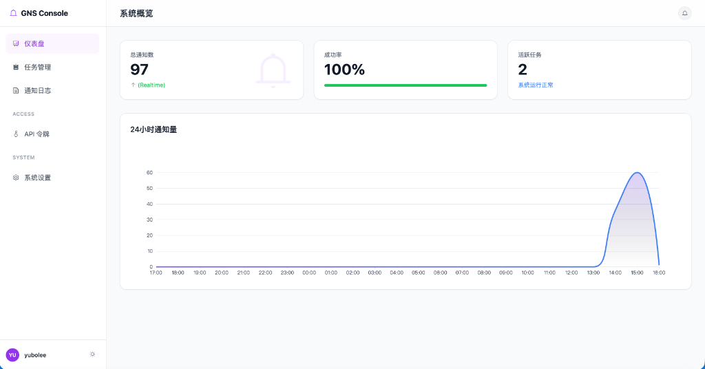

# 通用通知系统 (GNS)

**GNS (General Notification System)** 是一个现代化的企业级通知分发平台。它将内部各种通知渠道（邮件、钉钉、企业微信、短信等）统一为一个稳定可靠的 API，并提供高级的任务调度、速率限制和基于角色的权限控制 (RBAC) 能力。



---

## 核心功能

### 🚀 核心能力
- **统一 API**：通过唯一的 `/api/v1/notify` 接口向任意渠道发送通知。
- **任务管理**：支持创建通知模版，并支持变量注入（如 `${variable}`）。
- **灵活调度**：
  - **Cron 表达式**：支持自动化定时任务（例如：每日报表）。
  - **API 触发**：通过 SDK 随时按需发送。
- **队列与 Worker**：基于 Redis Stream 的异步处理机制，支持高并发吞吐。

### 🛡️ 可靠性与安全性
- **速率限制**：基于 Redis 实现的流控，支持为每个任务配置“每小时”和“每天”的最大发送量。
- **静默模式**：支持定义“免打扰”时间段（例如 22:00 - 08:00），期间通知将被自动拦截或排队（可配置）。
- **访问控制**：
  - **RBAC**：内置管理员 (Admin)、团队管理员 (Team Admin) 和普通用户 (User) 角色。
  - **团队隔离**：团队管理员只能管理自己团队的资源。
  - **安全认证**：BCrypt 密码加密存储，支持基于 Token 的 API 访问。

### 📊 可观测性
- **仪表盘**：实时展示成功率、活跃任务数等关键指标。
- **全链路日志**：详细记录每一次发送的状态（成功、失败、被拦截）及错误信息。
- **审计追踪**：记录任务的创建与修改历史。

---

## 技术栈

- **后端**：Java 17, Spring Boot 3, MyBatis Plus
- **数据库**：MySQL 8.0, Redis 7 (Stream 队列 & 缓存)
- **前端**：Vue 3, Vite, TailwindCSS, Element Plus
- **架构**：模块化单体 (Modular Monolith) + Worker 模式

---

## 快速开始

### 前置要求
- JDK 17+
- Node.js 18+
- 本地运行 MySQL & Redis

### 1. 后端启动
```bash
# 1. 修改 src/main/resources/application.yml 中的 DB/Redis 配置

# 2. 编译并运行
./mvnw clean spring-boot:run
```
*注意：Flyway 会在启动时自动初始化数据库表结构。*

### 2. 前端启动
```bash
cd frontend
npm install
npm run dev
# 访问仪表盘：http://localhost:5173
```

### 3. 默认账号
- **管理员 (Admin)**：`admin` / `Lyb1217..`
- **团队管理员 (Team Admin)**：`team_admin` / `Lyb1217..`

---

## 客户端 SDK

GNS 提供了官方 SDK 以简化集成。源码位于 `sdks/` 目录。

### Python
```bash
pip install gns-sdk
```
```python
from gns_sdk import GNSClient
client = GNSClient(base_url="http://localhost:8080", token="YOUR_TOKEN")
client.send_notification(task_id="UUID", data={"name": "Alice"})
```

### Node.js
```javascript
const GNSClient = require('gns-sdk');
const client = new GNSClient('http://localhost:8080', 'YOUR_TOKEN');
await client.sendNotification({ taskId: 'UUID', data: { name: 'Alice' } });
```

### Go
```go
import "gns-sdk/gns"
client := gns.NewClient("http://localhost:8080", "YOUR_TOKEN")
client.SendNotification(gns.SendRequest{TaskId: "UUID", ...})
```

### Java
```java
GnsClient client = new GnsClient("http://localhost:8080", "YOUR_TOKEN");
client.sendNotification(SendRequest.builder().taskId("UUID").build());
```

关于 SDK 的发布流程，请参考 [PUBLISHING.md](PUBLISHING.md)。

---

## 项目结构
```
├── src/                  # Java 后端源码
├── frontend/             # Vue 3 前端源码
├── sdks/                 # 多语言客户端 SDK (Python, Go, Node, Java)
├── src/main/resources/
│   ├── db/migration/     # Flyway SQL 迁移脚本
│   └── application.yml   # 应用配置
└── README.md
```

---

## 许可证
MIT
